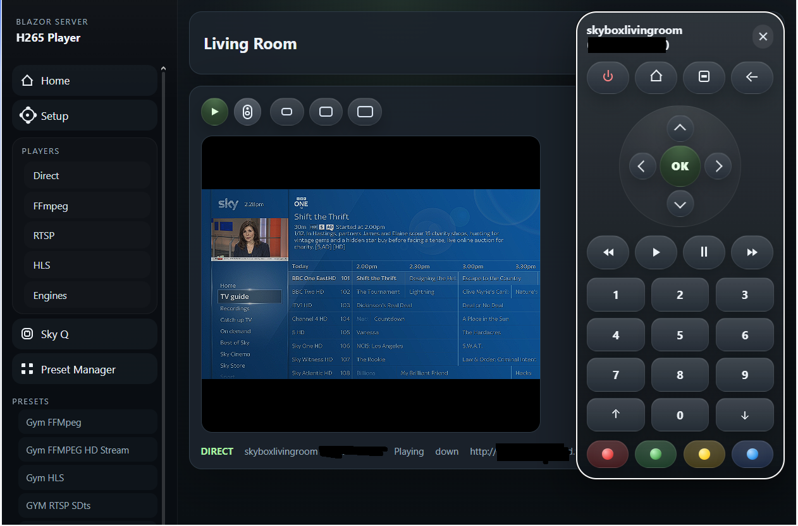

# Home Sky Q Live Streaming Player

Blazor Server application for securely viewing and controlling a live home Sky Q box over the internet with low latency.

This project is designed for self-hosted home setups where a Sky Q box is connected to a local IP encoder. It lets you watch your own Sky TV remotely in a browser, using your own hardware and network rather than relying on services like Sky Go.



## 🚀 Key Features

- 🌍 Remote browser playback for your own home Sky Q setup
- 📺 Support for HLS (`.m3u8`) and direct MPEG-TS browser playback
- 🎥 Managed FFmpeg ingest/transcode for awkward HTTP or RTSP sources
- 🧩 Compatibility with H.264 and H.265/HEVC encoder outputs
- ⚡ Low-latency playback paths depending on encoder and browser support
- 🎛️ Built-in Sky Q discovery and remote control
- 🔒 Authenticator-based external access with trusted local setup
- 🐧 Self-hosted deployment with Linux install scripts for updates and re-runs
- 🪟 Windows PowerShell installer with Windows Service deployment

## 🧠 How It Works

1. A Sky Q box is connected to a local HDMI encoder.
2. The encoder exposes a stream such as HLS, MPEG-TS, or RTSP.
3. This app either plays that stream directly in the browser or normalizes it through FFmpeg first.
4. You access the app remotely through your own private deployment, typically with Tailscale or Cloudflare Zero Trust in front of it.

## ⚠️ Personal Use

This project is intended for personal use only, so you can access content you already subscribe to using your own hardware.

It does not:

- provide access to Sky content by itself
- bypass subscription requirements
- include pirated streams or third-party content feeds

## 🐧 Recommended Linux Install

For transparency, the short URL and the direct raw GitHub URL are both shown below. The short URL currently redirects to the same installer script.

Short URL:

```bash
curl -fsSL https://bit.ly/4naEQhR | sudo bash
```

Direct raw GitHub URL:

```bash
curl -fsSL https://raw.githubusercontent.com/itdevconsulting/HomeSkyQLiveStreamingPlayer/main/scripts/install-from-github.sh | sudo bash
```

Short URL fallback:

```bash
wget -qO- https://bit.ly/4naEQhR | sudo bash
```

Direct raw GitHub fallback:

```bash
wget -qO- https://raw.githubusercontent.com/itdevconsulting/HomeSkyQLiveStreamingPlayer/main/scripts/install-from-github.sh | sudo bash
```

Detailed Linux deployment notes are in [LINUX-INSTALL.md](LINUX-INSTALL.md).

Linux uninstall details are also covered there, including service-only removal and full cleanup commands.

## 🪟 Recommended Windows Install

Quick install from GitHub:

```powershell
$tmp = Join-Path $env:TEMP "install-from-github.ps1"
Invoke-WebRequest https://raw.githubusercontent.com/itdevconsulting/HomeSkyQLiveStreamingPlayer/main/scripts/install-from-github.ps1 -OutFile $tmp
powershell -NoProfile -ExecutionPolicy Bypass -File $tmp
```

The Windows installer:

- installs the `.NET 10` SDK if needed
- downloads FFmpeg if needed
- publishes the app in `Release`
- installs the Windows service `SkyStreamingService`
- uses display name `SkyQ Streaming Service`
- preserves local runtime state on re-runs

Detailed Windows deployment notes are in [WINDOWS-INSTALL.md](WINDOWS-INSTALL.md).

Windows uninstall details are also covered there, including service-only removal and full cleanup commands.

## 📦 What It Does

- discovers Sky Q boxes on the local private network
- sends Sky Q remote-control commands over the LAN control socket
- plays browser-friendly direct streams such as MPEG-TS or HLS
- supports FFmpeg-managed ingest/transcode for awkward HTTP or RTSP sources
- stores presets that bind a stream source to a specific Sky Q box

## 🔐 Security Model

- trusted setup is limited to localhost, RFC1918 private networks, and Tailscale
- external users authenticate with enrolled TOTP authenticator codes
- the recommended deployment model is to keep the app private and place Tailscale or Cloudflare Zero Trust in front of it

## 🛠️ Linux Installer Summary

The bootstrap installer:

- clones or updates the public repo
- hard-resets and cleans the source checkout on re-runs so it matches the latest remote branch exactly
- installs `ffmpeg` if needed
- installs the `.NET 10` SDK if needed
- publishes the app in `Release`
- stops `SkyStreamingService` before replacing the deployed app
- fully replaces `/opt/skystreamingservice/app` with the latest published build
- writes or updates the `SkyStreamingService` systemd service and restarts it
- preserves local runtime state across upgrades

## 🛠️ Windows Installer Summary

The Windows installer:

- downloads the current repo snapshot from GitHub or runs from a local checkout
- installs the `.NET 10` SDK into `C:\Program Files\dotnet` if needed
- downloads the FFmpeg Windows essentials ZIP if needed
- publishes the app in `Release`
- recreates and restarts the `SkyStreamingService` Windows service
- deploys the published app to `C:\ProgramData\SkyQStreamingService\app`
- preserves `local-settings.json`, `auth-settings.json`, `transcoder-settings.json`, `direct-skyq-presets.json`, `skyq-cache.json`, and `runtime\` on re-runs

Uninstall guidance:

- Linux: see [LINUX-INSTALL.md](LINUX-INSTALL.md) for service removal and optional full purge commands
- Windows: see [WINDOWS-INSTALL.md](WINDOWS-INSTALL.md) for service removal and optional full purge commands

After install, open:

```text
http://127.0.0.1:5221/setup
```

From there:

1. Confirm the FFmpeg path.
2. Save setup.
3. Enter the email address to enroll for remote access.
4. Generate and scan the authenticator QR code.
5. External users then sign in at `/auth/login`.

## 📝 Notes

- FFmpeg is not bundled. Install it locally and save the detected path on the `Setup` page.
- Browser HEVC/H.265 support still varies by browser and platform. `H.264` remains the safer compatibility option.
- Some aggressive form-filler, password-manager, or in-page autofill browser extensions can inject DOM changes that interfere with Blazor Server and break the active circuit. If users see intermittent circuit disconnects or browser-side DOM errors, retest with in-page autofill disabled for this site first.
- Machine-local runtime files such as auth settings, presets, cache data, and transcoder state are intentionally not published in the public repo.
- You are responsible for complying with local law and any applicable Sky terms for your own use of the system.
